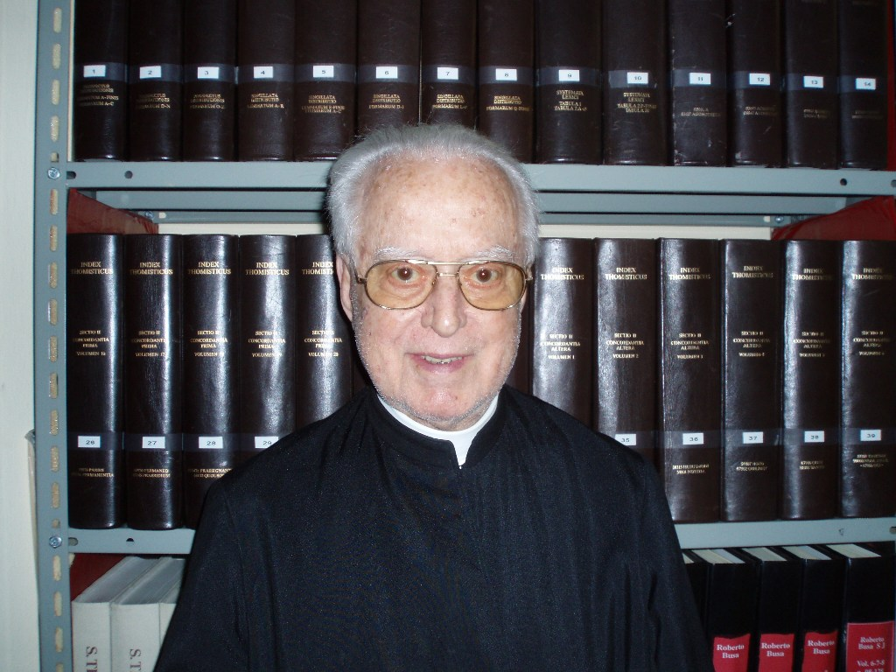

[comment]: <> "LTeX: language=fr"

# L'*index thomisticus*

<https://www.corpusthomisticum.org/it/index.age>

De quoi s'agit-il ?

## Le travail de Roberto Busa

Roberto Busa (1913 — 2011) était un prêtre jésuite italien spécialiste de Thomas d'Aquin

[comment]: <> "LTeX: language=en"

> According to the scholarly practices, I first > searched through tables and subject indexes for
> the words of *praesens* and *praesentia*. I soon learned that such words in Thomas
> Aquinas are peripheral: his doctrine of presence is linked with the preposition *in*. My next step
> was to write out by hand 10 000 3"×5" cards, each containing a sentence with the word in or a word
> connected with *in*. Grand games of solitaire follow.  [@busa1980AnnalsHumanitiesComputing]

[comment]: <> "LTeX: language=fr"

---

- L'objectif intial de Busa est philosophique et théologique
- Mais sa thèse est qu'on ne peut accéder à la pensée d'un⋅e auteurice que si on maîtrise sa façon
  d'employer le langage.
- Il lui faut donc étudier Thomas d'un point de vue philologique et linguistique.
- Il formule donc en 1946 le projet d'un grand concordancier des œuvre de Thomas

---

- Réalisation immédiate : la tâche est trop vaste pour être faite sans assistance
- Il se met donc en quête de « machinerie » pour l'aider

  > any gadget that might help [@busa1980AnnalsHumanitiesComputing]
- Il parvient à obtenir l'aide gracieuse d'IBM pour le réaliser
- Le projet a duré 30 ans, pour produire une transcription complète de 179 ouvrages en forme lisible
  par des machines de l'époque (des cartes perforées !), et une lemmatisation semi-automatique.

---

- 10 631 980 mots
- 1 500 km de câble
- 10 000 h de calcul
- 1 000 000 d'heures de travail humain

---

## La naissance des humanités numériques

On identifie souvent l'*index thomisticus* comme le premier travail d'humanités numériques mené à
terme, même si Busa suggère que d'autres initiatives plus anciennes ont existé.

Quoi qu'il en soit, c'est un travail d'une ampleur exceptionnelle pour l'époque qui a eu une
influence considérable sur le développement des HN et du TAL en montrant que ce genre d'entreprise
était possible.

[Quelques images du projet](http://melissaterras.blogspot.com/2013/10/for-ada-lovelace-day-father-busas.html)

# La concordance automatique

Revenons sur la thèse de Busa

> Le lecteur ne doit pas simplement attacher ses propres significations aux mots
> qu’il lit, mais il doit aussi rechercher les significations que les mots ont pour
> l’auteur lui-même.

Elle reflète entre autres les idées dites du *tournant linguistique* en philosophie.

---

> Par ailleurs tous les mots fonctionnels et grammaticaux (qui dans mon esprit ne sont pas vides du
> tout mais au contraire très riche sur le plan philosophique) manifestent la logique la plus
> profonde de l’être qui génère les structures de base du discours humain ».
> [@busa1980AnnalsHumanitiesComputing]

---

## Introduction de l'informatique

- Comme outil pour embrasser une masse de données
- Mais surtout pour conduire l’analyse à un niveau jusque-là inaccessible. Il ne s’agit plus
  seulement d’interpréter le texte, mais aussi de l’observer comme objet.
- La rencontre des humanités avec l’industrie

---

- La mise en chiffre du monde
  - Dans la suite de Shannon, Turing : le calcul computationnel, la statistique
  - La statistique (utilisée comme politique) devient un langage de représentation de la réalité
    sociale [@desrosieres2010PolitiqueGrandsNombres].
- Développement de l’étude informatique des textes.

# Numériser pour compter

La notion de statistiques textuelles est antérieure à Busa et se développe parallèlement à ses
travaux [@leon2014DataTurnPremiers,@lebart1994StatistiqueTextuelle].

- Jean-Baptiste Estoup (1868 – 1950), Georges Zipf (1902 – 1950) ou Gustav Herdan (1897 – 1968), sur
  les propriétés statistiques des lexiques
- Charles Muller (1909 — 2015), Pierre Guiraud (1912 – 1983), Étienne Brunet (1936) explorent les
  applications des statistiques lexicales et textuelles entre autres à la stylistique

---

On parle autour des années 80 de *lexicométrie*, puis autour des années 2000 de *textométrie*, pour
rendre plus explicite qu'on ne se limite pas au simple lexique [@pincemin2020TextometrieQuestion].

Ces évolutions vont de pair avec

- La croissance incessante des capacités matérielles de traitement (informatique)
- La généralisation du stockage numérique des documents (numérisés et créés numériquement)
- L'avènement depuis le début du 20ème siècle des méthodes quantitatives en LSHS.

# Les plateformes d'analyse

L'intérêt grandissant pour les méthodes de statistiques textuelles va aussi de pair avec la création
de logiciels permettant à des non-informaticien⋅ne⋅s de les mettre en œuvre :

- [Hyperbase](http://hyperbase.unice.fr) (1989)
- [Lexico](http://lexi-co.com) (1994)
- [Le Trameur](http://www.tal.univ-paris3.fr/trameur/) (2008)
- [TXM](http://textometrie.ens-lyon.fr) (2010) [@heiden2010TXMPlateformeLogicielle]
- …

# Les grands corpus

Premières initiatives :

- Corpus de Brown (1964)
- *British National Corpus* (1991)

En français :

- [Frantext](https://www.frantext.fr/)
- [*Corpus for Idiolectal Research* (CIDRE)](https://www.ortolang.fr/market/corpora/cidre)
- [Corpus du Français Parlé Parisien](http://cfpp2000.univ-paris3.fr/Corpus.html)
- [*Multicultural Paris French* Corpus](https://mpfvitrine.modyco.fr)
- [Corpus d'Étude pour le Français Contemporain](https://repository.ortolang.fr/api/content/cefc-orfeo/11/documentation/site-orfeo/index.html)
- [ESLO](http://eslo.huma-num.fr)

## À l'heure du web

- [*Common Crawl*](https://commoncrawl.org/)
- [*Open Super-large Crawled Aggregated coRpus* (OSCAR)](https://oscar-corpus.com/)

# Bibliographie

::: {#refs}
:::
