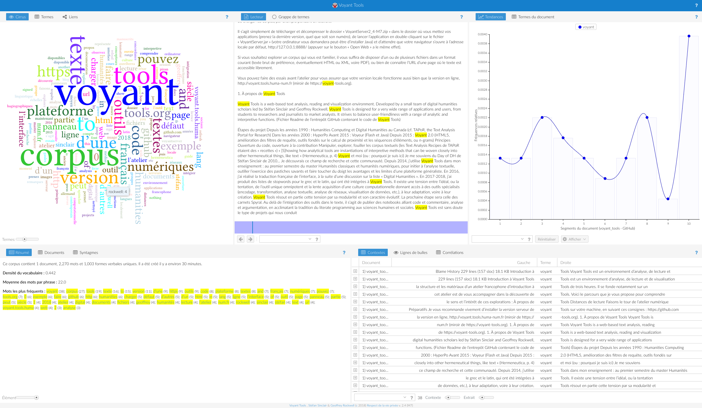
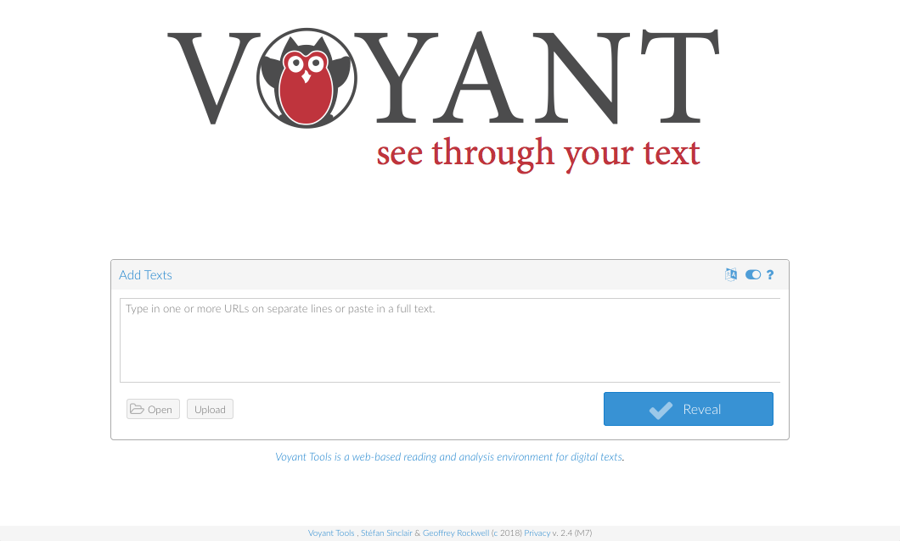
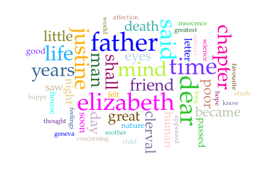
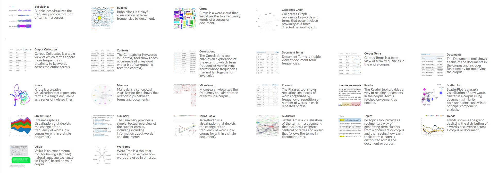

[comment]: <> "LTeX: language=fr"

Librement adapté du [tutoriel d'Aurélien
Berra](https://github.com/aurelberra/voyant_tools/blob/2a84546d345f0300ab1e660c5cd9ac26acb23ffb/tutorial/voyant_tools_intro_fr.md)

# Introduction 

[Voyant Tools](http://voyant-tools.org/) est un environnement d’analyse, de lecture et de
visualisation de textes numériques. [@rockwell2016HermeneuticaComputerAssistedInterpretation]

---

# Accéder à Voyant Tools

- Plateforme web : <https://voyant-tools.org> ou <http://voyant.tools.huma-num.fr>.
- Installable en local : <https://github.com/sgsinclair/VoyantServer/wiki/VoyantServer-Desktop>.
  - Pas besoin d’une connexion Internet,
  - Pas de partages de données (droits d'auteur, confidentialité)
  - Plus rapide, plus facile (pas de partage de ressources et contrôle)

---

# À propos de Voyant Tools

[comment]: <> "LTeX: language=en"

> Voyant Tools is a web-based text analysis, reading and visualization environment. Developed by a
> small team of digital humanities scholars led by Stéfan Sinclair and Geoffrey Rockwell, Voyant
> Tools is designed for a very wide range of applications and users, from students to researchers
> and journalists to market analysts. It strives to balance user-friendliness with a range of
> analytic and interpretive functions.  
> ([*Readme*](https://github.com/sgsinclair/Voyant/blob/master/README.md) de l’entrepôt GitHub
> contenant le code de Voyant Tools)

[comment]: <> "LTeX: language=fr"

## Historique du projet

- Développement des humanités numériques au Canada depuis les années 1990
- Années 2000 : Stéfan Sinclair développe le logiciel HyperPo dans le cadre de ses recherches
  doctorales sur l’Oulipo.
- Environ 2006 la plateforme est ouverte sous le nom Voyeur, puis Voyant. Elle recourt notamment aux
  technologies Flash et Java.
- 2015 : Voyant 2.0, réécrit et amélioré

## Principes

- Logiciel libre
  - Code distribué publiquement et librement modifiable (licence *copyleft*
    [GPLv3](https://www.gnu.org/licenses/quick-guide-gplv3.html))
  - Toutes les contributions sont les bienvenues
- Objectif : Manipuler, explorer, fouiller les corpus textuels
  - Interactions rapides et faciles avec les données
  - Conviction que la théorie et la pratique sont intimement mêlées.

---

[comment]: <> "LTeX: language=fr"

> Analytical tools are instantiations of interpretive methods that can be woven closely into
> other hermeneutical things, like text [@rockwell2016HermeneuticaComputerAssistedInterpretation]

[comment]: <> "LTeX: language=en"

## Construction des humanités numériques

- Tension entre
  - L’idéal de l’outil unique omnipotent
  - La personalisation des outils pour les adapter aux usages et aux pratiques individuelles
- Voyant Tools résout en partie cette tension par sa modularité et son caractère évolutif.

# Distances de lecture : une première approche

## Cirrus

---

Observez le nuage de mots précédent et disponible également à [https://page.hn/fwxr07](https://voyant-tools.huma-num.fr/?corpus=441a840307eb65229b6375b6f0fbb560&view=Cirrus).

- Que représente ce nuage, à votre avis ?
- Parmi ses caractéristique
  - Lesquelles sont issues d’une quantification du texte ?
  - Tous les mots vous semblent-ils pertinents ?
  - Manque-t-il des mots ?

---

Quand vous aurez réfléchi à ces questions, manipulez les paramètres du nuage :

- Changez le nombre de termes pris en compte au moyen du curseur
- Modifiez la liste des mots vides filtrés en accédant aux options (icône en haut à droite)
  - Que se passe-t-il quand on ne filtre rien ?

## `Termes`/`Terms`

La [table des
fréquences](https://voyant-tools.huma-num.fr/?corpus=441a840307eb65229b6375b6f0fbb560&view=DocumentTerms)

Observez :

- Les colonnes cachées (survolez les en-têtes des colonnes affichées et cliquez sur la flèche à droite)
  - Quelles colonnes vous sont cachées par défaut ?
- Les *sparklines*, qui résument dans la colonne de droite les tendances des termes au fil du
  texte
  - Quel(s) usages imaginez-vous pour ces *sparklines* ?

## Lecteur/Reader

[L'affichage complet](https://voyant-tools.huma-num.fr/?corpus=441a840307eb65229b6375b6f0fbb560&view=Reader)

- Que se passe-t-il si vous survolez un mot ? si vous le sélectionnez ?
  - Que représente alors la frise située sous le texte ?
- Testez les fonctions de reauêtes (champ de texte en bas à gauche) : Comment sont répartis les mots commençant par « death » dans ce texte ?

## `Contextes`/`Contexts`

[Le
concordancier](https://voyant-tools.huma-num.fr/?corpus=441a840307eb65229b6375b6f0fbb560&query=father&view=Contexts)
(du type Keyword in Context, KWIC).

- Observez les curseurs, en particulier celui qui se nomme « Contexte » : à quoi sert-il ?
- Un menu vous donne la possibilité de restreindre le corpus à certains documents. Est-il utile ici ? Pourquoi ?

## Autres outils

# L’atelier numérique

Pour observer plus méthodiquement l’environnement de travail complet, suivez le lien vers le [corpus
de Shakespeare](https://voyant-tools.org/?corpus=shakespeare).

La configuration par défaut de Voyant combine un ensemble de modules complémentaires et parfois
coordonnés. Des panneaux supplémentaires sont présents lorsque vous travaillez sur une collection de
textes, comme c’est le cas dans cette série de pièces.

---

Principe des **vues** :

- À chaque **outil** correspond un **panneau**, que vous pouvez réduire ou agrandir.
- Pour chaque panneau, des **options** sont disponibles. Survolez, puis cliquez.
- Chaque panneau peut être manipulé ou exploré d’une façon qui lui est propre.
- Chaque panneau peut modifier le contenu d’autres panneaux.

---

Voyant Tools propose actuellement 24 outils en ligne (voir la
[documentation](http://voyant-tools.org/docs/#!/guide/tools)) :

- Linguistique de corpus / computationnelle (dénombrement, concordance, co-occurrence)
- Humanités numériques (modélisation thématique aka *topic modelling*)
- Expérimentaux, artistiques (lesquels, à votre avis ?).

---

Testez les fonctions d’export, qui dépendent de l’outil concerné. Elles peuvent fournir :

- une référence bibliographique
- une image produite par un outil
- d’autres types de données produites par un outil (formats HTML, TSV et JSON)
- une nouvelle URL pour afficher un outil séparément, dans la fenêtre entière du navigateur
- un fragment de code pour intégrer le panneau ou la vue à une page HTML

---

Quelles sont les fonctions des outils suivants ?

- `Résumé`/`Summary`
- `Documents`
- `Syntagmes`/`Phrases`

- `Tendances`/`Trends`
- `Corrélations`/`Correlations`
- `Collocations`/`Collocates`
- `Liens`/`Links`

- `Nuage de points`/`Scatter plot`
- `Thèmes`/`Topics`

# Explorez vos corpus !

## Créer un corpus

Voyant vous autorise à créer un corpus de plusieurs manières :

- Vous pouvez **copier-coller** du texte.
- Vous pouvez saisir une ou plusieurs **URL** que Voyant ira visiter.
- Vous pouvez **charger** un texte à partir d’un ou de plusieurs fichiers, en texte brut ou formaté

## Exemples commentés

Voici quelques exemples, à l’occasion desquels je précise certains points. Les fichiers mentionnés
sont disponibles dans le dossier [data](https://github.com/aurelberra/voyant_tools/tree/master/data)
de ce même entrepôt (pour les télécharger, faites un clic droit, CTRL-clic ou un clic à deux doigts,
en fonction de la configuration de votre système).

---

### Import par des URL

[La page de Wikipédia réputée la plus longue](https://en.wikipedia.org/wiki/List_of_compositions_by_Franz_Schubert)

Cette page requiert clairement la liste de mots vides « Multilingue », pourquoi ?

---

Français moderne : Lautréamont, [*Les Chants de Maldoror*](http://athena.unige.ch/athena/lautreamont/laut_mal.html)

- La prévalence du vocabulaire corporel me semble frappante.
- Le découpage en mots (tokénisation, ou segmentation) par défaut conserve comme unités des éléments
  contenant une apostrophe tels que « n’est ». Vous pouvez changer ce réglage avant de créer le
  corpus en changeant de segmentation dans les options de « Préparation/*Processing* »

---

Moyen français : Rabelais,
[*Pantagruel*](http://athena.unige.ch/athena/rabelais/rabelais-pantagruel.html)

- Observer les distributions des noms propres Pantagruel et Panurge. Que remarquez-vous ?
- Trouver une bonne liste de mots vide n'est pas forcément évident ici. Pourquoi à votre avis ?

---

### Import de fichiers TXT

Latin : César, *La Guerre des Gaules*
  ([fichier](https://raw.githubusercontent.com/aurelberra/voyant_tools/master/data/caesar_bellum_gallicum.txt))

Sélectionnez bien sûr les mots vides de la liste « Latin ». Voyez que, faute de lemmatisation, les
formes du nom de César (« *caesar*, *caesarem* ») ou des mots signifiant « camp » et « ennemis »
(*« castra*, *castris* » et « *hostium*, *hostes*, *hostibus* ») sont distinguées.

---

Latin : César, *La Guerre des Gaules*, texte lemmatisé
  ([fichier](https://raw.githubusercontent.com/aurelberra/voyant_tools/master/data/caesar_bellum_gallicum_lem.txt))

Sans être parfaite, la lemmatisation suffit ici pour constater la différence avec le texte
précédent. Pour vous en assurer, vous pouvez charger les textes dans deux fenêtres et exporter
certaines vues ou listes.

---

### Import depuis une archive zip

Français, espagnol et anglais : [*Digital Humanities Quarterly*
12.1](http://www.digitalhumanities.org/dhq/vol/12/1/), numéro de revue sur les humanités numériques
hispanophones et francophones, en accès libre (licence CC-BY-ND) à charger en version nettoyée
depuis [le
dépôt](https://github.com/aurelberra/voyant_tools/blob/master/data/dhq_12_1_xml.zip?raw=true)

- Comme précédemment, sélectionnez la liste de stopwords « Multilingue ».
- Il est utile d’éditer la liste pour filtrer des termes comme « http », « *digital* » et
  « *humanities* ».

# Bibliographie

::: {#refs}
:::
