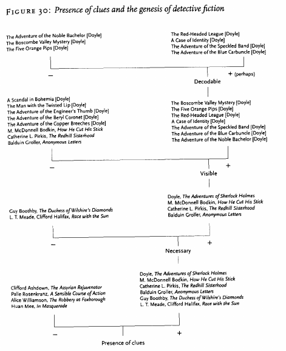

[comment]: <> "LTeX: language=fr"

# Archives historiques hypermédia

- <http://www.blakearchive.org/>
- <http://www.rossettiarchive.org>

Visiter ces deux sites

- Que présentent-ils ?
- Présenter rapidement les personnages concernés par ces archives.
- À quoi peuvent servir des archives de ce type ? Qu'apportent-elles par rapport à des collections
  physiques ?

## *The William Blake Archive*

- Le projet de numérisation de l’œuvre de William Blake(1993-XXXX)

> William Blake, né le 28 novembre 1757 à Londres où il est mort le 12 août 1827, est un artiste
> peintre, graveur et poète pré-romantique britannique.

---

- Conçue à partir de 1993 par Morris Eaves, Robert N. Essick et Joseph Viscomi, la William
- « rendre justice au caractère multiforme de l’œuvre du poète anglais »
  [@mounier2018HumanitesNumeriquesHistoire]

Le projet n'est pas le même que celui de l'*Index Thomisticus* : c'est moins un travail de
numérisation pour l'expoloitation semi-automatique qu'une nouvelle forme d'édition

---

Une édition **numérique** 

- Étendre l’accessibilité des éditions originales publiées par Blake 
  - Chercheureuses
  - Grand public
- Accès **unifié**, **multimédia** et **hypermédia**
- Édition numérique de la revue académique spécialisée sur Blake qui existe depuis les années 1970

---

Considérée aujourd’hui comme un modèle pour les projets de numérisation de corpus en
humanités numériques

Qualité du travail d’édition :

- Choix des matériaux
- Encodage du corpus
- Interfaces de navigation et de consultation

## Les archives Rossetti

Les archives Rossetti facilitent l'étude scientifique de Dante Gabriel Rossetti, peintre, designer,
écrivain et traducteur qui, selon John Ruskin et Walter Pater, était la force artistique la plus
importante et la plus originale de la seconde moitié du XIXe siècle en Grande-Bretagne

---

- Achevées en 2008 selon le plan établi en 1993.
- Œuvres picturales et textuelles et un vaste corpus contextuel de documents.
- Documents codés pour une recherche et une analyse structurées.
- Accompagnés de notes et de documents éditoriaux.
- Objectif : inclure des images numériques de haute qualité de tous les états documentaires des.
  œuvres de DGR qui subsistent :
  - Manuscrits, épreuves, éditions originales
  - Dessins, peintures, photographies, objets d'art
  - …

---

Permettre aux chercheureuses de visualiser en un clic des reproductions numériques d’originaux, qui
autrement sont difficiles d'accès et d'accéder à d'outils de recherche (index, appareils critiques,
moteur de recherche) pour explorer le corpus.

# « Textualité radiante »

Constituer des archives de collection de documents numériques apporte de nouvelles méthodologies et
de nouveaux cadres théoriques : notamment Jerome McGann et la **textualité radiante**

> Le caractère ouvert et non clos de l’archive numérique bouleverse les pratiques de monographie et
> d’éditions savantes, elles-mêmes transformées par les mediums.

---

Archives hypermédias : des projets d’archives
numériques au-delà du texte

- Donner accès au texte avec les outils du numérique
- Donner accès au fac-similé de l’édition
- Créer de l’intertextualité et des liens intermédias

---

> L’archive permet ainsi d’un côté de rassembler des matériaux hétérogènes autour de l’œuvre elle-
> même, rendant compte non seulement de l’œuvre originelle (il ne s’agit pas seulement de donner
> accès à une transcription qui n’est que le texte dématérialisé, mais d’abord au fac-similé de
> l’édition princeps qui en restitue autant que possible la matérialité), mais aussi de
> l’intertextualité qui la lie à d’autres œuvres, textuelles, picturales, matérielles – autrement
> dit, sa « radiance » même.

[@mounier2018CeQueOrdinateur]

# Les bibliothèques multimédia

Rechercher les entrées liées à la recherche « durkheim »

- Dans le catalogue général de la BNF : <https://catalogue.bnf.fr>
- Dans le catalogue de données de la BNF : <https://data.bnf.fr>
- Dans Gallica : <https://gallica.bnf.fr>

De quels types d'objets numériques s'agit-il ? Pour quels usages ?

---

Catalogue général :

- Tous les ouvrages d’Émile Durkheim
- Des outils de recherche dans le catalogue

---

Catalogue de données :

- Des personnes
- Des organisations
- Des œuvres
- Des thèmes
- Des lieux
- Des périodiques

---

Gallica :

- Des documents divers
- Des facs-similés
- Du son
- Des images

---

Et partout des liens entre archives, bases de données, documents…

# De nouvelles pratiques

## De recherche

- Lire, entendre, voir
- Lier, relier, « hyperlier »
- Analyser et interpréter

# D'enseignement et d'art

- [Un monde meilleur ?](http://abw.blue), un simulateur d'uchronies
- [The beautiful walk](http://www.thebeautifulwalk.com) marcher réellement pour visiter
  virtuellement
- [Plague incorporated](https://www.ndemiccreations.com/en/22-plague-inc), un simulateur d'épidémie
- [Rebels Inc](https://www.ndemiccreations.com/en/51-rebel-inc) un simulateur de reconstruction de
  régions en guerre
- [Géomotifs](https://www.geomotifs.fr) réalité augmentée pour la découverte du patrimoine

# *Distant Reading*

- L’étude littéraire sur de vastes corpus nécessite « la montée en généralité » le repérage de
  « patterns »
- De nouvelles méthodes pour bouleverser les études littéraires (opposition *close reading* et
  *distant reading*)

---

> Je dirais simplement que nous avons beaucoup à apprendre des méthodes des sciences sociales et des
> sciences naturelles [@moretti2013DistantReading]

---

_**Distant reading**_

- Concept proposé par Franco Moretti [@moretti2000ConjecturesWorldLiterature] pour décrire une
  approche en analyse littéraire.
- Littéralement « lecture à distance », s’oppose à la « lecture de près », la méthode classique
  utilisée en analyse littéraire.
- En *close reading*, l’attention est portée sur l’œuvre qui est lue et analysée en détails.

---

Pour Moretti le *close reading* est incapable de saisir toute l’envergure de la littérature : même
si une telle approche est possible pour deux cents livres d’un siècle donné, que savons-nous
réellement sur la littérature du siècle en question si celle-ci se compte en centaines de milliers
d’œuvres ?

---

Solution : utilisations d'outils de sciences (humaines et inhumaines, sociales et asociales) :
statistiques, métadonnées, paratextes, représentations…

# Modèles abstraits

*Graphs, Maps, Trees* : modèles abstraits pour l’histoire littéraire [@moretti2005GraphsMapsTrees]

- Graphiques pour analyser les évolutions
- Cartes pour la localisation et les relations
- Arbres pour la structure

---

---

---

# L’informatique et les humanités

William McCarthy, *Humanities Computing* [@mccarty2005HumanitiesComputing]

- Intérêt de la contrainte imposée au chercheur par le traitement numérique
- Ce n’est pas la puissance de calcul qui est véritablement intéressante
- C’est la **contrainte** imposée par le traitement numérique de l’information

---

- Læ chercheureuse doit formaliser à la fois le matériau (le transformer en données) et le
  raisonnement mobilisé pour traiter ces données.
- Importance de la modélisation : à la différence de Moretti ce n’est pas le modèle qui l’intéresse,
  mais l’activité de modélisation.

---

> La seconde qualité du modèle qui le distingue du concept est sa manipulabilité, c’est-à-dire sa
> capacité à être manié, géré, travaillé ou traité par tout moyen manuel ou extension mécanique […]
> En d’autres termes, les modèles informatiques, aussi parfaits soient-ils, doivent être davantage
> compris comme des états temporaires d’un processus de connaissance à venir que comme des
> structures fixes de connaissance.

---

- La modélisation ne permet pas de produire des connaissances nouvelles, mais aide à se poser de
  nouvelles questions (notamment ce qui ne fonctionne pas avec le modèle).
- Démarche expérimentale non pour valider des hypothèses, mais pour générer de nouvelles questions
  par des résultats négatifs.

# Bibliographie

::: {#refs}
:::