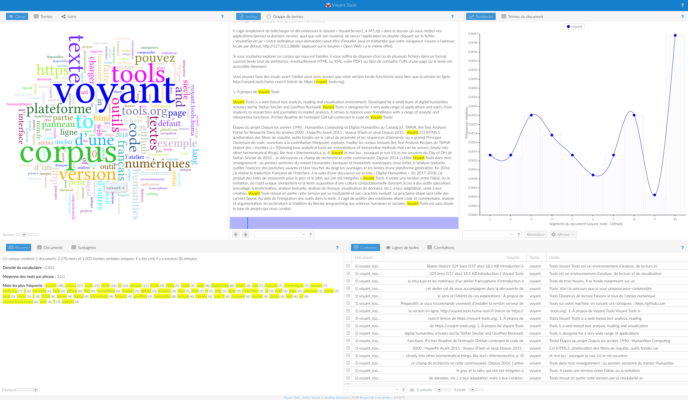

[comment]: <> "LTeX: language=fr"

Librement adapté du [tutoriel d'Aurélien
Berra](https://github.com/aurelberra/voyant_tools/blob/2a84546d345f0300ab1e660c5cd9ac26acb23ffb/tutorial/voyant_tools_intro_fr.md)

# Introduction 

[Voyant Tools](http://voyant-tools.org/) est un environnement d’analyse, de lecture et de
visualisation de textes numériques. [@rockwell2016HermeneuticaComputerAssistedInterpretation]

---

# Accéder à Voyant Tools

- Plateforme web : <https://voyant-tools.org> ou <http://voyant.tools.huma-num.fr>.
- Installable en local : <https://github.com/sgsinclair/VoyantServer/wiki/VoyantServer-Desktop>.
  - Pas besoin d’une connexion Internet,
  - Pas de partages de données (droits d'auteur, confidentialité)
  - Plus rapide, plus facile (pas de partage de ressources et contrôle)

---

# À propos de Voyant Tools

[comment]: <> "LTeX: language=en"

> Voyant Tools is a web-based text analysis, reading and visualization environment. Developed by a
> small team of digital humanities scholars led by Stéfan Sinclair and Geoffrey Rockwell, Voyant
> Tools is designed for a very wide range of applications and users, from students to researchers
> and journalists to market analysts. It strives to balance user-friendliness with a range of
> analytic and interpretive functions.  
> ([*Readme*](https://github.com/sgsinclair/Voyant/blob/master/README.md) de l’entrepôt GitHub
> contenant le code de Voyant Tools)

[comment]: <> "LTeX: language=fr"

## Historique du projet

- Développement des humanités numériques au Canada depuis les années 1990
- Années 2000 : Stéfan Sinclair développe le logiciel HyperPo dans le cadre de ses recherches
  doctorales sur l’Oulipo.
- Environ 2006 la plateforme est ouverte sous le nom Voyeur, puis Voyant. Elle recourt notamment aux
  technologies Flash et Java.
- 2015 : Voyant 2.0, réécrit et amélioré

## Principes

- Logiciel libre
  - Code distribué publiquement et librement modifiable (licence *copyleft*
    [GPLv3](https://www.gnu.org/licenses/quick-guide-gplv3.html))
  - Toutes les contributions sont les bienvenues
- Objectif : Manipuler, explorer, fouiller les corpus textuels
  - Interactions rapides et faciles avec
  - Conviction que la théorie et la pratique sont intimement mêlées.

---

[comment]: <> "LTeX: language=fr"

> Analytical tools are instantiations of interpretive methods that can be woven closely into
> other hermeneutical things, like text [@rockwell2016HermeneuticaComputerAssistedInterpretation]

[comment]: <> "LTeX: language=en"

## Construction des humanités numériques

- Tension entre
  - L’idéal de l’outil unique omnipotent
  - La personalisation des outils pour les adapter aux usages et aux pratiques individuelles
- Voyant Tools résout en partie cette tension par sa modularité et son caractère évolutif.

# Distances de lecture : une première approche

## Cirrus

---

Observez le nuage de mots précédent et disponible également à [https://lstu.stemy.me/mary](https://voyant-tools.huma-num.fr/?corpus=084f1ee1a8ff6e370da5b98a3d19a71b&view=Cirrus).

- Que représente ce nuage, à votre avis ?
- Parmi ses caractéristique
  - Lesquelles sont issues d’une quantification du texte ?
  - Tous les mots vous semblent-ils pertinents ?
  - Manque-t-il des mots ?

---

Quand vous aurez réfléchi à ces questions, manipulez les paramètres du nuage :

- Changez le nombre de termes pris en compte au moyen du curseur, 
- Modifiez la liste des mots vides filtrés en accédant aux options (icône en haut à droite)

## `Termes`/`Terms`

La [table des
fréquences](https://voyant-tools.huma-num.fr/?corpus=084f1ee1a8ff6e370da5b98a3d19a71b&view=CorpusTerms)

---

Avec-vous vu :

- Les colonnes cachées (survolez les en-têtes des colonnes affichées et cliquez sur les flèches) ?
- Les *sparklines*, qui résument dans la colonne de droite les tendances des termes au fil du
  corpus ?

## Lecteur`/`Reader`

[L'affichage complet](https://voyant-tools.huma-num.fr/?corpus=084f1ee1a8ff6e370da5b98a3d19a71b&view=Reader)

- Que se passe-t-il si vous survolez un mot, si vous le sélectionnez ?
- Que représente la frise située sous le texte ?
- Avez-vous testé les fonctions de requête ?

## `Contextes`/`Contexts`

[Le concordancier](https://voyant-tools.huma-num.fr/?corpus=084f1ee1a8ff6e370da5b98a3d19a71b&view=Reader) (du type Keyword in Context, KWIC).

- Avez-vous remarqué les curseurs, en particulier celui qui se nomme « Contexte » ? 
- Un menu vous donne la possibilité de restreindre le corpus à certains documents.

## Autres outils

## L’atelier numérique

Pour observer plus méthodiquement l’environnement de travail complet, revenez à la page d’accueil de Voyant (en cliquant sur l’icône de la maison dans le bandeau bleu tout en haut de la fenêtre) et ouvrez l’un des deux corpus proposés par défaut sous le bouton « Ouvrir », le [corpus de Shakespeare](http://voyant-tools.org/?corpus=shakespeare).

La configuration par défaut de Voyant combine un ensemble d’outils, ou modules, qui sont complémentaires et parfois coordonnés. Remarquez que des panneaux supplémentaires sont présents lorsque vous travaillez sur une collection de textes, comme c’est le cas dans cette série de pièces.

Pour naviguer dans cet environnement, vous devez comprendre quelques principes de fonctionnement d’une **vue** :

- À chaque **outil** correspond un **panneau**, que vous pouvez réduire ou agrandir.
- Pour chaque panneau, des **options** sont disponibles. Survolez, puis cliquez.
- Chaque panneau peut être manipulé ou exploré d’une façon qui lui est propre.
- Chaque panneau peut modifier le contenu d’autres panneaux.

Avant de remplacer un outil par un autre dans un panneau, en cliquant sur l’icône de la fenêtre, prenez le temps de regarder la liste des outils. Elle est structurée en catégories non exclusives, selon les échelles de lecture et les types de présentation.

Voyant Tools propose actuellement 24 outils en ligne (voir la [documentation](http://voyant-tools.org/docs/#!/guide/tools)). Certains d’entre eux font partie des fondements de la linguistique de corpus ou de la linguistique computationnelle (dénombrement, concordance, co-occurrence), certains sont en vogue dans les humanités numériques (modélisation thématique, ou *topic modelling*), certains sont plus expérimentaux ou artistiques (lesquels, à votre avis ?). D’autres outils sont en préparation (par exemple un outil de cartographie lié à une fonction de reconnaissance des entités nommées).

Vous verrez bientôt les différents moyens de créer un corpus en important du texte.

Testez par vous-même les fonctions d’export, qui dépendent de l’outil concerné. Elles peuvent fournir :

- une référence bibliographique comportant les noms des concepteurs, de la plateforme et de l’outil
- une image produite par un outil (formats PNG et SVG)
- d’autres types de données produites par un outil (formats HTML, TSV et JSON)
- une nouvelle URL pour afficher un outil séparément, dans la fenêtre entière du navigateur
- un fragment de code pour intégrer le panneau ou la vue à une page HTML (comme dans les exemples
  qui seront donnés plus loin, une capsule est créé par une balise *iframe*, qui fait appel à l’API
  de Voyant Tools ; certains CMS, comme WordPress, sont notoirement rétifs à cette procédure)

Notez qu’il est parfois utile d’ouvrir plusieurs interfaces et de comparer des corpus, par exemple une version sans lemmatisation et une version lemmatisée d’un texte, ou bien un texte dans sa langue originale et une traduction.

Vous aurez déjà constaté que la fonction d’aide apparaît dans tous les panneaux, sous le point d’interrogation.

Voici les outils essentiels que je vous propose de passer en revue :

- `Résumé`/`Summary` offre une synthèse quantitative du corpus.
- `Documents` rappelle la structure du corpus.
- `Syntagmes`/`Phrases` détecte les groupes de mots récurrents.

- `Tendances`/`Trends` met en évidence la distribution du ou des termes sélectionnés au sein du corpus, lequel est découpé en fonction des documents qui le constituent ou en segments d’égale longueur.
* `Corrélations`/`Correlations` met en rapport des paires de termes et mentionne leur degré statistique de corrélation.
- `Collocations`/`Collocates` fournit également une liste des paires de mots apparaissant souvent dans les mêmes contextes.
- `Liens`/`Links` propose une visualisation des termes fréquemment liés. Double-cliquez sur un terme pour accéder à des options.

- `Nuage de points`/`Scatter plot` est une approche graphique des distances entre termes ou entre documents, selon diverses méthodes d’analyse bien connues, dont l’analyse des correspondances et l’analyse en composants principaux. Je vous conseille pour un outil comme celui-ci de redimensionner le panneau ou d’exporter une vue dans une fenêtre à part. Zoomez en sélectionnant une zone et dézoomez en double-cliquant. Double-cliquez sur un point pour le supprimer du graphique ou en faire le centre des calculs de proximité. Explorez les options des panneaux latéraux, en particulier le choix du nombre de grappes (*clusters*) et du nombre de dimensions d’analyse.
* `Thèmes`/`Topics` réalise une modélisation thématique : tous les termes du corpus sont algorithmiquement regroupés dans des « sacs de mots » selon leurs co-occurrences et le lecteur peut voir émerger des ensembles sémantiques, des bizarreries à expliquer ou des absurdités apparentes qui invitent à modifier les paramètres ou réfléchir plus longuement aux données. Faites des essais.

# Explorez vos corpus !

## Créer un corpus

Pour charger vos corpus dans Voyant, utilisez la version locale que vous avez installée sur votre ordinateur (voyez la section « Préparatifs » ci-dessus) ou bien l’un des serveurs suivants : <http://voyant.tools.huma-num.fr> ou <https://voyant-tools.org>, qui afficheront par défaut une interface dans la langue de votre navigateur.

La langue de l’interface peut être modifiée dès la page d’accueil et à tout moment en cliquant sur l’icône prévue à cet effet (voir la [documentation](http://voyant-tools.org/docs/#!/guide/languages)). Remarquez cependant que la langue est l’un des paramètres qui peuvent être contrôlés par une modification de l’URL de base : <https://voyant.tools.huma-num.fr/?lang=fr> affiche l’interface en français, tandis que <http://voyant.tools.huma-num.fr/?lang=en> affiche l’interface en anglais.

De la même façon, l’URL de votre corpus peut vous servir de signet, si vous copiez la chaîne de caractères qui constitue son identifiant unique (essayez d’ajouter à l’URL de base `?corpus=75b440214b14d5402b2d9ab1e0150d17` – reconnaissez-vous le texte ?). Les corpus créés sur le serveur de Voyant Tools ont une certaine pérennité : ils demeurent accessibles tant qu’ils sont visités régulièrement, par exemple une fois toutes les trois semaines.

Voyant vous autorise à créer un corpus de plusieurs manières. L’Unicode (UTF-8) est recommandé et le texte brut est le format le plus typique, mais le plus souvent d’autres encodages et formats fonctionneront parfaitement.

- Vous pouvez **copier-coller** du texte.
- Vous pouvez saisir une ou plusieurs **URL** que Voyant ira visiter.
- Vous pouvez **ouvrir** l’un des corpus qui sont disponibles par défaut, au moyen du bouton « Ouvrir ».
- Vous pouvez **charger** un texte à partir d’un ou de plusieurs fichiers, en texte brut ou aux formats HTML, XML, PDF, RTF, DOCX, XLSX, voire DOC et XLS – ou encore ZIP, pour regrouper dans un fichier compressé des fichiers dans d’autres formats.

Si le format de vos fichiers sources pose un problème, pensez qu’il est généralement facile de les convertir dans un autre format ([Pandoc](http://pandoc.org/) est un outil de salubrité publique et les [scripts de transformation du consortium TEI](https://github.com/TEIC/Stylesheets#stylesheets) sont efficaces). En passant, je vous recommande de travailler dans un [éditeur de texte](https://fr.wikipedia.org/wiki/%C3%89diteur_de_texte), et non seulement dans des logiciels de traitement de texte comme Libre Office ou Word, qui visent surtout la présentation imprimée : [Atom](https://atom.io) est disponible pour tout système d’exploitation, par exemple.

Ensemble d’outils très accommodant du point de vue des langues et des formats, Voyant Tools est une plateforme d’analyse textuelle et, en tant que telle, demeure résolument logo-centrique et texto-centrique. Vous n’y trouverez pas d’outil pour analyser des images d’imprimés ou de manuscrits, pour aligner textes et images ou pour traiter des flux audio ou vidéo.

# Exemples commentés

Voici quelques exemples, à l’occasion desquels je précise certains points. Les fichiers mentionnés sont disponibles dans le dossier [data](https://github.com/aurelberra/voyant_tools/tree/master/data) de ce même entrepôt (pour les télécharger, faites un clic droit, CTRL-clic ou un clic à deux doigts, en fonction de la configuration de votre système).

Avant de charger ces corpus, prenez le temps de découvrir les options d’import. Il s’agit de fonctions avancées, qui vous permettent de nommer votre corpus, de ne charger qu’une partie du texte (grâce à des expressions rationnelles pour le texte brut, à des expressions XPath pour le XML, à des sélecteurs en CSS pour le HTML), de préciser les options d’import des tableaux, d’imposer une langue ou un mode de segmentation et de protéger votre corpus par un mot de passe. Dans cette fenêtre d’options, les titres des rubriques contiennent des liens vers la documentation.

## Import par des URL

- Anglais : [la page de Wikipédia réputée la plus
  longue](https://en.wikipedia.org/wiki/List_of_compositions_by_Franz_Schubert)
    * Cette page requiert clairement la liste de mots vides « Multilingue », n’est-ce pas ?
- Français moderne : Lautréamont, [*Les Chants de
  Maldoror*](http://athena.unige.ch/athena/lautreamont/laut_mal.html)
    - La prévalence du vocabulaire corporel me semble frappante.
    - Sur un plan technique, remarquez que le découpage en mots (tokénisation, ou segmentation) par
      défaut à l’import du texte conserve comme unités des éléments contenant une apostrophe tels
      que « n’est ». Vous pouvez changer ce réglage avant de créer le corpus en choisissant dans les
      options de « Préparation/*Processing* » la segmentation par « Limites de mots simples/*Simple
      Word Boundaries* » (« n’est » n’apparaît plus comme un mot et ses deux composantes, « n » et
      « est », sont filtrées).
    - Même si « l’homme » disparaît ainsi pour accroître le nombre d’occurrences de « homme », il
      reste que le texte n’est pas lemmatisé, mais découpé en formes graphiques : « homme » et
      « hommes » sont séparées. Selon les langues et les objectifs de l’analyse, l’absence actuelle
      de lemmatisation dans Voyant Tools est un obstacle plus ou moins grave. Dans de nombreux cas,
      des requêtes un peu plus complexes suffisent : ici, « homme* » et « homme|hommes » permettent
      de regrouper les formes « homme » et « hommes », de même que « faire|fais|fait » regroupe les
      formes les plus fréquentes du verbe « faire ». Explorez ces possibilités en cliquant sur le
      point d’interrogation ou en consultant la page qui documente les [modes de
      requête](http://voyant-tools.org/docs/#!/guide/search). Si la lemmatisation est indispensable
      à votre recherche, elle devra faire partie d’une phase préparatoire, d’un pré-traitement
      spécifique à la langue de votre corpus, avant l’import dans Voyant Tools.
- Moyen français : Rabelais,
  [*Pantagruel*](http://athena.unige.ch/athena/rabelais/rabelais_pantagruel.html)
    - Je vous suggère d’observer par exemple les distributions des noms propres Pantagruel et
      Panurge.
    - Pour la plupart des corpus non contemporains (comme le moyen français ici), témoignant d’un
      état de langue non classique (grec archaïque) ou marqués par une forte fluidité orthographique
      (éditions non normalisées), les mots vides ne seront pas adaptés d’emblée. Il est souvent
      possible de modifier la liste proposée par défaut pour éliminer les formes les plus
      embarrassantes pour l’analyse. Pour un travail plus précis, il faudra sans doute trouver une
      liste pertinente, ce qui n’est pas évident s’il s’agit d’un corpus peu ou prou ancien. Bien
      que toute recherche ait ses propres critères de pertinence en la matière, progressivement
      définis, je vous conseille de rendre publiques vos listes si vous passez un certain temps à
      les élaborer. Dans le domaine philologique, j’apprécie par exemple l’ouverture du Classical
      Language Toolkit ([CLTK](http://docs.cltk.org/)).

Puisqu’il est question d’URL, j’insère ici deux exemples d’intégration à une page HTML : [exemple 1](https://aurelienberra.org/temp/voyant.html) et [code](https://github.com/aurelberra/aurelienberra/blob/master/static/temp/voyant.html) correspondant ; [exemple 2](http://voyant-tools.org/docs/#!/guide/search), issu de la documentation de Voyant.

# Import de fichiers TXT

- Latin : César, *La Guerre des Gaules*
  ([fichier](https://github.com/aurelberra/voyant_tools/blob/master/data/caesar_bellum_gallicum.txt))
    - Le texte du PHI 5 a été légèrement nettoyé. Sélectionnez bien sûr les mots vides de la liste
      « Latin ». Voyez que, faute de lemmatisation, les formes du nom de César
      (« *caesar*, *caesarem* ») ou des mots signifiant « camp » et « ennemis » (*« castra*,
      *castris* » et « *hostium*, *hostes*, *hostibus* ») sont distinguées.
- Latin : César, *La Guerre des Gaules*, texte lemmatisé
  ([fichier](https://github.com/aurelberra/voyant_tools/blob/master/data/caesar_bellum_gallicum_lem.txt))
    - Sans être parfaite, la lemmatisation suffit ici pour constater la différence avec le texte
      précédent. Pour vous en assurer, vous pouvez charger les textes dans deux fenêtres et exporter
      certaines vues ou listes.

# Import de fichiers HTML ou XML, compressés dans une archive ZIP

- Français, espagnol et anglais : [*Digital Humanities Quarterly* 12.1](http://www.digitalhumanities.org/dhq/vol/12/1/), numéro de revue sur les humanités numériques hispanophones et francophones, en accès libre (licence CC-BY-ND)
- Comme précédemment, sélectionnez la liste de stopwords « Multilingue ». Il est utile en l’occurrence d’éditer la liste pour filtrer des termes comme « http », « *digital* » et « *humanities* ».
- Notez que dans le fichier ZIP proposé en exemple ([fichiers XML](https://github.com/aurelberra/voyant_tools/blob/master/data/dhq_12_1_xml.zip)), j’ai exclu quatre fichiers XML de la source, en raison d’une erreur de lecture de certains nœuds. Si les droits d’auteur et la configuration des sites vous le permettent, il est assez aisé de collecter des pages HTML, par exemple avec l’outil en ligne de commande [`wget`](https://programminghistorian.org/en/lessons/automated-downloading-with-wget) (vous obtenez par exemple ces [fichiers HTML](https://github.com/aurelberra/voyant_tools/blob/master/data/dhq_12_1_html.zip)).

# Exploration libre

Il est temps pour moi de vous laisser expérimenter.

# Et ensuite ? 

Outre la version française (sur le serveur de [Voyant Tools](https://voyant.tools.huma-num.fr/?lang=fr) ou sur celui d’[Huma-Num](http://voyant.tools.huma-num.fr/?lang=fr)), des versions dans d’[autres langues](http://voyant-tools.org/docs/#!/guide/languages) sont mises en ligne à mesure que des collègues traduisent l’interface. La [version serveur](https://github.com/sgsinclair/VoyantServer/#voyant-server) de Voyant Tools vous permet de faire fonctionner localement la plateforme. Le [code](https://github.com/sgsinclair/Voyant) de la plateforme est publié en *open source* (licence GPL).

Pour plus de détails, consultez le [manuel de Voyant Tools](http://voyant-tools.org/docs/#!/guide/start) (licence CC-BY). Un [tutoriel](https://voyant.tools.huma-num.fr/docs/#!/guide/tutorial) anglophone destiné à servir de base pour l’organisation d’ateliers ou de formations est en cours de rédaction. Pour savoir qui a fait quoi, selon quels principes et en employant quelles technologies, la page [*About*](https://voyant.tools.huma-num.fr/docs/#!/guide/about) de cette documentation est tout indiquée. La [*Gallery*](https://voyant.tools.huma-num.fr/docs/#!/guide/gallery) fournit des exemples variés et le site [Hermeneuti.ca](http://hermeneuti.ca/) illustre l’insertion de panneaux de Voyant dans des essais en ligne.

# Bibliographie

::: {#refs}
:::
