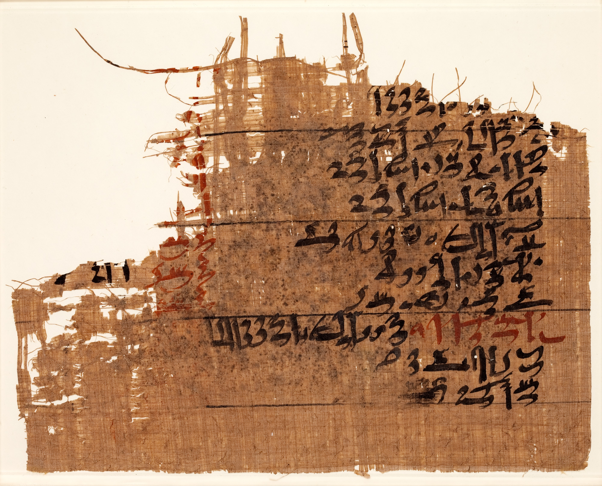

[comment]: <> "LTeX: language=fr"

# Les premières bibliothèques

## Asie de l'Ouest

D'après @ryholt2019LibrariesAlexandriaAncient

Mésopotamie :

- Premières traces d'écriture autour de -3400
- Premières collections de textes/écrits (sur tablettes d'argile) entre -2600 et -2300 (périodes d'Uruk, pré-dynastique et empire Akkadien)
- Collections/proto-archives de textes administratifs, éducatifs et littérature entre -1900 et -1600 (période paléo-babylonienne)
- -1750 : [tablette de plainte à Ea-Nasir](https://commons.wikimedia.org/wiki/File:Complaint_tablet_to_Ea-Nasir_2020.jpg)

---

Empire Hittite (Anatolie) :

- Collections de tablettes liées à des écoles, temples, palais

Au moins une bibliothèque/archive manifeste à Hattusa (𒄩𒀜𒌅𒊭, capitale de l'empire) :

- Fonction propre de conservation et reproduction
- Usage de **catalogues**

---

Développement progressif :

- Syrie et Levant à partir de l'age du bronze (-1400)
- Empires assyrien et néo-babylonien à partir de -800 (mais dans la continuité des cultures précédentes)

---

Bibliothèque d'Ashubarnipal (𒀸𒋩𒆕𒀀) à Ninive (𒉌𒉡𒀀, Akkadien *Ninua*) autour de -600

- 25 000 à 30 000 tablettes encore conservées (environ 1200 textes)
- Politique systématique d’enrichissement menée par le roi, premier roi lettré d'Assyrie (d'après lui)
- Conservation du « savoir universel »
- Archives, histoire, magie, textes littéraires ([épopée de Gilgamesh](https://www.britishmuseum.org/collection/object/W_K-3382))

---

> O Mighty King, remember now that only gods stay in eternal watch.  
> Humans come then go, that is the way fate decreed on the Tablets of Destiny.  
> So someday you will depart, but till that distant day  
> Sing, and dance.  
> Eat your fill of warm cooked food and cool jugs of beer.  
> Cherish the children your love gave life.  

---

> Bathe away life's dirt in warm drawn waters.  
> Pass the time in joy with your chosen wife.  
> On the Tablets of Destiny it is decreed  
> For you to enjoy short pleasures for your short days.  

Épopée de Gilgamesh (tablette 10)

---

Bibliothèque d'Ashubarnipal, conservée au British Museum

## Égypte

- Premières traces d'écritures vers -3200
- Traces de textes à partir de -2600 mais conservation difficile
- Bibliothèques funéraires à partir de la 12ème dynastie (autour de -2000)
- Collection de papyrus médicinaux dits « du Ramesseum » (trouvés sous le temple funéraire de Ramsès
  2 mais antérieurs de 600 ans) autour de -1700
- À partir de -1600 : bibliothèques institutionnelles et privées

---

Fragment d'un des papyrus médicinaux dits « du Ramesseum »

## Asie de l'Est

- Premières traces d'écriture vers -1250 ([os
  oraculaires](https://en.wikipedia.org/wiki/Oracle_bone_script)), puis [caractères sur
  bronze](https://en.wikipedia.org/wiki/Chinese_bronze_inscriptions)
- Invention du papier probablement autour de -200
- Une culture de l'écrit et des bibliothèques très tôt, encouragées par les autorités civiles et
  religieuses

## Amérique centrale

- Inventions indépendantes de l'écriture ([au moins](https://en.wikipedia.org/wiki/Cascajal_Block)
  depuis -900)
- Livres en papier d'écorce de figuier, souvent en rouleaux ou en accordéon
- Des milliers qui existaient, il ne nous en reste que quatre.
- Destruction par les missionnaires catholiques dans une entreprise intentionnelle de culturicide.

---

> We found a large number of books in these characters and, as they contained nothing in which were
> not to be seen as superstition and lies of the devil, we burned them all, which they regretted to
> an amazing degree, and which caused them much affliction.

(Diego de Landa Calderón, *Relación de las cosas de Yucatán*, 1566 in @gates1978YucatanConquest)

---

Il est certain que des bibliothèques ou des institutions similaires existaient, mais leur
destruction systématique ne nous en a laissé que peu de trace et peu de recherches (et encore moins
de recherches menées par des natifves) traitent de cette question.

---

# Bibliothèques gréco-romaines

- À partir de -500
- Au départ, fondations privées ouvertes à un public choisi.
- Instruments d’apparat, de puissance, et de convivialité.
- À partir d’Alexandrie (autour de -300) : conservatoires du savoir
- Instruments de propagande intellectuelle : les fonds des bibliothèques publiques romaines sont
  sélectifs (auteurs interdits : Ovide sous Auguste)

---

- Pas de simples lieux d’étude, mais de véritables lieux sociaux et de loisirs.
- Bâtiments ouverts, associant portiques, jardins, gymnase, thermes.
- Lieux de discussion et de promenade. Lecture collective, discussions érudites
- À Rome, ouvertes à tous : en réalité fréquentées par l’élite cultivée

## Alexandrie

- Alexandrie (Ἀλεξάνδρεια), Empire Ptolémaïque (Πτολεμαϊκὴ βασιλεία, actuelle Égypte)
- Fondée vers -300 par Ptolémée 1er (Πτολεμαῖος Σωτήρ, fondateur de la dynastie) ou son fils
  Ptolémée 2 (Πτολεμαῖος Φιλάδελφος)
- Partie du Mouseion d'Alexandrie (Μουσεῖον τῆς Ἀλεξανδρείας)
- Détruite entre le premier et le deuxième siècle de notre ère.

---

- La plus célèbre bibliothèque de l'Antiquité et réunissait les ouvrages les plus importants de l'époque.
- Le mythe fondateur de toutes les bibliothèques
- Un lieu de recherche et d'étude, attachée à une proto-université
- Sa disparition alimente tous les fantasmes de la conservation et de la perte des documents.

# Les bibliothèques chrétiennes

- Existence attestée dès le Bas-Empire (Alexandrie devient une bibliothèque chrétienne)
- Associées à un centre épiscopal ou monastique. À l’origine très spécialisées.
- La décomposition progressive de l’Empire Romain entraine la disparition des bibliothèques
  publiques et des centres d’éducation.
- Les institutions chrétiennes (évêchés, monastères) deviennent centres d’éducation et concentrent
  toute la littérature existante : œuvres profanes, grammaire, philosophie etc.
- Les monastères sont aussi centres de production des livres : règle de Saint- Benoit. Ateliers de
  copie, échanges d’ouvrages. Gardiens de la culture antique.

# Monde arabe

incl. شنقيط (Šinqīṭ/Chinguetti), Tumbutu (Tombouctou)

# Bibliographie

::: {#refs}
:::
