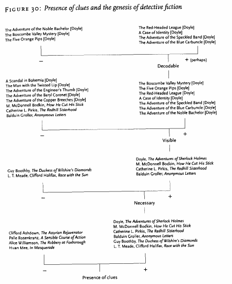

[comment]: <> "LTeX: language=fr"

# *Distant Reading*

- L’étude littéraire sur de vastes corpus nécessite « la montée en généralité » le repérage de
  « patterns »
- De nouvelles méthodes pour bouleverser les études littéraires (opposition *close reading* et
  *distant reading*)

---

> Je dirais simplement que nous avons beaucoup à apprendre des méthodes des sciences sociales et des
> sciences naturelles [@moretti2013DistantReading]

---

_**Distant reading**_

- Concept proposé par Franco Moretti [@moretti2000ConjecturesWorldLiterature] pour décrire une
  approche en analyse littéraire.
- Littéralement « lecture à distance », s’oppose à la « lecture de près », la méthode classique
  utilisée en analyse littéraire.
- En *close reading*, l’attention est portée sur l’œuvre qui est lue et analysée en détails.

---

Pour Moretti le *close reading* est incapable de saisir toute l’envergure de la littérature : même
si une telle approche est possible pour deux cents livres d’un siècle donné, que savons-nous
réellement sur la littérature du siècle en question si celle-ci se compte en centaines de milliers
d’œuvres ?

---

Solution : utilisations d'outils de sciences (humaines et inhumaines, sociales et asociales) :
statistiques, métadonnées, paratextes, représentations…

# Modèles abstraits

*Graphs, Maps, Trees* : modèles abstraits pour l’histoire littéraire [@moretti2005GraphsMapsTrees]

- Graphiques pour analyser les évolutions
- Cartes pour la localisation et les relations
- Arbres pour la structure

---

---

---

# L’informatique et les humanités

William McCarthy, *Humanities Computing* [@mccarty2005HumanitiesComputing]

- Intérêt de la contrainte imposée au chercheur par le traitement numérique - Ce n’est pas la
puissance de calcul qui est véritablement intéressante - C’est la **contrainte**
  imposée par le traitement numérique de l’information

---

- Læ chercheureuse doit formaliser à la fois le matériau (le transformer en données) et le
  raisonnement mobilisé pour traiter ces données.
- Importance de la modélisation : à la différence de Moretti ce n’est pas le modèle qui l’intéresse,
  mais l’activité de modélisation.

---

> La seconde qualité du modèle qui le distingue du concept est sa manipulabilité, c’est-à-dire sa
> capacité à être manié, géré, travaillé ou traité par tout moyen manuel ou extension mécanique […]
> En d’autres termes, les modèles informatiques, aussi parfaits soient-ils, doivent être davantage
> compris comme des états temporaires d’un processus de connaissance à venir que comme des
> structures fixes de connaissance.

---

- La modélisation ne permet pas de produire des connaissances nouvelles, mais aide à se poser de
  nouvelles questions (notamment ce qui ne fonctionne pas avec le modèle).
- Démarche expérimentale non pour valider des hypothèses, mais pour générer de nouvelles questions
  par des résultats négatifs.

# Bibliographie

::: {#refs}
:::